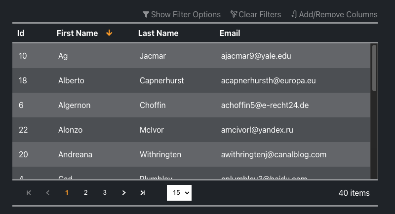

<p align="center">
  
</p>

<h1 align="center">Data Grid Vue</h1>

<p align="center">
  <a href="https://github.com/sponsors/nruffing">
    
  </a>
</p>
<br />

Customizable native Vue3 data grid with very limited dependencies. Leverages a flat html structure and CSS grid to allow full layout control. Features include numerous slots, paging, sorting, filtering, CSS variables, client and server-data retrieval, client and server-side grid-state storage (i.e. local storage, session storage, etc.), dynamic column widths, selectable page size, drag-and-drop column reorder powered by dragon-drop-vue, and ability for user to add/remove columns.

<p align="center">
  <a href="https://github.com/nruffing/data-grid-vue/actions/workflows/ci_cd.yml">
    
  </a>
  <a href="https://github.com/nruffing/data-grid-vue/actions/workflows/docs_ci_cd.yml">
    
  </a>
  <a href="https://www.npmjs.com/package/data-grid-vue" target="_blank" aria-label="npm">
    
  </a>
  <a href="https://github.com/nruffing/data-grid-vue/blob/main/LICENSE" aria-label="MIT License">
    
  </a>
</p>

<hr />
<p align="center">
  :point_right: <a href="https://datagridvue.com/guide" target="_blank">Quick Start</a> :point_left:
</p>

<br />
<div class="example-image-container">
  
</div>

<br />

```vue
<dgv-data-grid
  v-model:columns="columns"
  :data="DEMO.data"
  :sort-options="{
    sortable: true,
    multiColumn: false,
  }"
  :allow-column-reorder="true"
  :show-column-selection="true"
>
</dgv-data-grid>
```

<hr />

## Features

* Leverages a flat html structure and CSS grid to allow full layout control. This allows versatility in the parent layout (e.g. a full page page, half page, etc.).
* CSS variables for quick theming
* Cell render templates
* Supply arrow function to get column's value
* Supply custom data service to provide custom implementation of data retrieval, paging, sorting, and filtering
* Built-in data services for client-side and server-side data retrieval, sorting, filtering and paging
* Server-side data service
  * If using the default data contracts (i.e. PageDataRequest and PageData) just a valid POST url is required to be configured
  * Optional hooks for modifying/replacing the Request and converting the returned data to a PageData object
  * If using an ASP.NET Core API with EF Core or any other ORM leveraging IQueryable [this library](https://github.com/nruffing/data-grid-vue-dotnet) can be used to automatically apply the PageDataRequest to an IQueryable.
* Sorting
  * Single and multiple column sorting
  * Enabled per column
* Filtering
  * Enabled per column
  * Default filter input and header cell template
  * Multiple operators
  * Filter inputs are displayed in each column and the filter row can be shown/hidden by the user with a toggle above the grid
  * Can be overridden with an externally supplied filter. This is useful to be able to implement a global search across multiple/all columns.
* Column widths can be specified with px, % or *
  * By default columns without a width specified will take up an equal share of the remaining space
  * The relative * unit can be used to specify a column to take a relational share of the remaining space
  * Column widths automatically regenerate when the window/page size changes
* Selectable page size with configurable available page sizes
* Optional drag and drop column reorder
* Optionally allow users to add/remove columns with column selection menu
* Built-in support for storing grid state in local storage, session storage or server-side with HTTP support similar to using the server-side data service
  * Supply custom storage service to provide custom implementation of storing a user's grid state
  * Saved grid state includes page size, which columns are displayed, current sort, current filters, current external filter, and column order
  * Local and session storage are specified as a prop per grid instance so consumer can have multiple grids with their own state
* Numerous slots to provide custom render templates including:
  * Entire options header (i.e. Show Filter Options, Clear Filters, etc.)
  * Individual options in the options header
  * Add/Remove columns popup content
  * Filter inputs per column
  * Header cell per column
  * Data cell per column

<hr />
<p align="center">
  :heart: <a href="https://github.com/sponsors/nruffing" target="_blank">Sponsor</a> :heart:
  <span>|</span>
  :point_right: <a href="https://datagridvue.com/guide" target="_blank">Quick Start</a> :point_left:
  <br /><br />
  :beetle: <a href="https://github.com/nruffing/data-grid-vue/issues/new?assignees=nruffing&labels=bug&projects=&template=bug_report.md&title=%5Bbug%5D">Report Bug</a>
  <span>|</span>
  :sparkle: <a href="https://github.com/nruffing/data-grid-vue/issues/new?assignees=nruffing&labels=enhancement&projects=&template=feature_request.md&title=%5Bfeature%5D">Feature Request</a>
  <span>|</span>
  :books: <a href="https://datagridvue.com" target="_blank">Documentation</a>
  <span>|</span>
  :question: <a href="https://github.com/nruffing/data-grid-vue/issues/new?assignees=nruffing&labels=support&projects=&template=support-request.md&title=%5Bsupport%5D">Questions</a>
  <span>|</span>
  :scroll: <a href="https://datagridvue.com/changelog" target="_blank">Changelog</a>
  <br/><br/>
  :package: <a href="https://www.npmjs.com/package/data-grid-vue" target="_blank">NPM</a>
  <span>|</span>
  :package: <a href="https://yarnpkg.com/package?name=data-grid-vue" target="_blank">Yarn</a>
</p>
<hr />

# Data Grid Vue

## Release Notes

### v2.4.0
  - `ServerSideStorageService` now has a generic type constraint to allow any type to be used for the user identifier sent in the request to get and set grid state.
  - `ServerSideStorageService.getGridState` and `ServerSideDataService.getPage` will now only try to deserialize the response body as JSON if the status code is `200 OK` and the response `Content-Type` header is `application/json`.
  - Default color values of CSS variables are now defined in hex.
  - Default accent color slightly altered to match documentation site.

### v2.3.0
  - Allow dragon-drop-vue directive names to be overridden via the data-grid-vue plugin options
  - Allow data-grid-vue component registration name to be overridden via the plugin options
  - Allow the click-outside directive name to be overridden via the plugin options
  - Add documentation for which CSS variables are available
  - Quick start guide
  - Fix spelling errors in documentation
  - Fix edit page links in documentation
  - Readme updates

### v2.2.0
  - Add clear filters callback to options-header slot
  - Fix column shown state in ColumnSelectionItem
  - Define slot types and add to documentation
  - Define emit types and add to documentation
  - Even more documentation improvements

### v2.1.2
  - Fix for sorting and filtering not working when the data grid is not configured to be paged.
  - Fix Icon component import in HeaderCell
  - Documentation improvements

### v2.1.1
  - Readme/documentation improvements
  - CSS improvements
  
### v2.1.0
  - Add css variable for input/select font size

### v2.0.0-beta
  > [!IMPORTANT]
  DataGridVue component is now exported as DataGridVueGrid in favor of using a new plugin to ensure proper setup. Plugin registers DataGridVueGrid component globally as dgv-data-grid.
   
  - Column reordering via drag-and-drop can be enabled on the grid with the allowColumnReorder property. Drag and drop is powered by [dragon-drop-vue](https://www.npmjs.com/package/dragon-drop-vue) and dragon drop global options can be set on the plugin options.
  - Hidden columns are now supported. A popup for users to add/remove columns from the view can be enabled with the showColumnSelection property.
  - Improved page size select styling.
  - Clear filters action
  - Add support for storing grid state in local storage, session storage or server-side with HTTP support similar to using the server-side data service
  - Bugfix for sort index display when more then one column is sorted

### v1.0.0
  - Table html structure replaced with css grid for better layout control
  - Full height and full height options removed in favor of css grid to allow for greater layout control in parent application
  - fix order of sorting and filtering in default client data service

### v0.1.4-alpha
  - fix import types export
  - update dev dependencies

### v0.1.1-alpha
  - remove console.log

### v0.1.0-alpha
  - add full height option which forces the footer to the bottom of the grids parent and will scroll only the grid rows
  - add thead and tbody elements
  - add ability to specify column widths with px, % and \*
  - add page size selection with customizable page size options

### v0.0.5-alpha
  - fix external filter

### v0.0.4-alpha
  - add support for externally specifying a filter

### v0.0.3-alpha
  - fix css variable names
  - use rems

### v0.0.2-alpha
  - properly specify location of types in package

### v0.0.1-alpha
  - initial release
