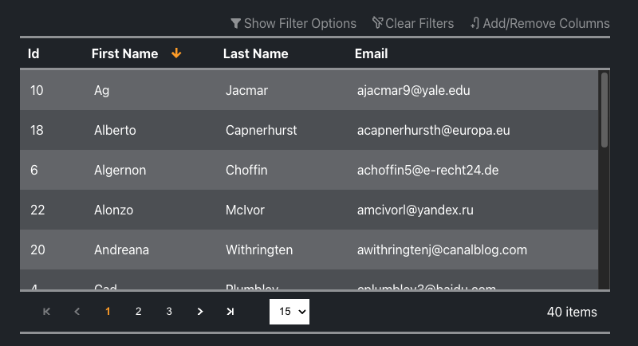

<p align="center">
  
</p>

<h1 align="center">Data Grid Vue</h1>

<p align="center">
  <a href="https://github.com/sponsors/nruffing">
    
  </a>
</p>
<br />

#include "./vuepress/shared/summary.md"

<p align="center">
  <a href="https://github.com/nruffing/data-grid-vue/actions/workflows/ci_cd.yml">
    
  </a>
  <a href="https://github.com/nruffing/data-grid-vue/actions/workflows/docs_ci_cd.yml">
    
  </a>
  <a href="https://www.npmjs.com/package/data-grid-vue" target="_blank" aria-label="npm">
    
  </a>
  <a href="https://github.com/nruffing/data-grid-vue/blob/main/LICENSE" aria-label="MIT License">
    
  </a>
</p>

<hr />
<p align="center">
  :point_right: <a href="https://datagridvue.com/guide" target="_blank">Quick Start</a> :point_left:
</p>

<br />
<div class="example-image-container">
  
</div>

<br />

#include "./vuepress/shared/simple-example-codeblock.md"

<hr />

#include "./vuepress/shared/features.md"

<hr />
<p align="center">
  :heart: <a href="https://github.com/sponsors/nruffing" target="_blank">Sponsor</a> :heart:
  <span>|</span>
  :point_right: <a href="https://datagridvue.com/guide" target="_blank">Quick Start</a> :point_left:
  <br /><br />
  :beetle: <a href="https://github.com/nruffing/data-grid-vue/issues/new?assignees=nruffing&labels=bug&projects=&template=bug_report.md&title=%5Bbug%5D">Report Bug</a>
  <span>|</span>
  :sparkle: <a href="https://github.com/nruffing/data-grid-vue/issues/new?assignees=nruffing&labels=enhancement&projects=&template=feature_request.md&title=%5Bfeature%5D">Feature Request</a>
  <span>|</span>
  :books: <a href="https://datagridvue.com" target="_blank">Documentation</a>
  <span>|</span>
  :question: <a href="https://github.com/nruffing/data-grid-vue/issues/new?assignees=nruffing&labels=support&projects=&template=support-request.md&title=%5Bsupport%5D">Questions</a>
  <span>|</span>
  :scroll: <a href="https://datagridvue.com/changelog" target="_blank">Changelog</a>
  <br/><br/>
  :package: <a href="https://www.npmjs.com/package/data-grid-vue" target="_blank">NPM</a>
  <span>|</span>
  :package: <a href="https://yarnpkg.com/package?name=data-grid-vue" target="_blank">Yarn</a>
</p>
<hr />

#include "./vuepress/shared/changelog.md"

<hr />

## Development Environment

This repo is setup with three [pnpm workspaces](https://pnpm.io/workspaces).

The root workspace is setup with the following options via a `.nmprc` file.

```
#include ".npmrc"
```

The following will install dependencies for all workspaces including the root.

```sh
pnpm install
```

### Workspaces

#### 1. Root Workspace

The root workspace is setup to build/pack the actual `data-grid-vue` package.

```sh
pnpm build
```

The compiled javascript module and typescript type definitions are built into the `dist` folder at the root of the repo.


#### 2. Vuepress Documentation Site

The `vuepress` folder contains the workspace for the source of the documentation site hosted at [https://datagridvue.com](https://datagridvue).

The site is built using [Vuepress 2](https://v2.vuepress.vuejs.org/).

```sh
pnpm run docs:dev
```

The `./vuepress/generated` folder contains markdown source that documents the exports of the `data-grid-vue` package. These markdown files are automatically generated from [TSdoc](https://tsdoc.org/) block comments in the source code using [TypeDoc](https://typedoc.org/guides/overview/) and a custom TypeDoc plugin in `./scripts/typedoc` that parses the comments from `.vue` files. The plugin makes a bit of assumptions on where the comments are located and only supports SFCs using the Vue Options API.

The following script will generate the contents of the `./vuepress/generated` folder. This script is also run during the husky pre-commit hook.

```sh
pnpm run typedoc
```

The `./vuepress/dotnet-generated` folder contains markdown source that documents the public interfaces of the [DataGridVueDotnet](https://github.com/nruffing/data-grid-vue-dotnet) NuGet package. These markdown files are generated in the [example api](https://example-api.datagridvue.com/) powering server-side examples of `data-grid-vue`. [XmlDocMarkdown.Core](https://ejball.com/XmlDocMarkdown/) is used to generate markdown from the XML comments in the source. The script located in `./scripts/dotnet-doc-download` downloads the latest markdown from the example-api and places it in the `./vuepress/dotnet-generated` folder.

The following script will generate the contents of the `./vuepress/dotnet-generated` folder. This currently does not run automatically anywhere.

```sh
pnpm run dotnet-doc
```


#### 3. Local Development App

The `dev-app` folder contains the workspace for an app the consumes `data-grid-vue` directly from the `lib` folder for local development and testing.

```sh
pnpm run dev-app:dev
```


### Development Tools

* VS Code
  * Extensions
    * [Code Spell Checker](https://marketplace.visualstudio.com/items?itemName=streetsidesoftware.code-spell-checker)
    * [Volar](https://marketplace.visualstudio.com/items?itemName=Vue.volar)
    * [Volar - TypeScript Plugin](https://marketplace.visualstudio.com/items?itemName=Vue.vscode-typescript-vue-plugin)
* Node v18.*
* pnpm v8.*
* NPM dependencies
  * Vue v3.3.8+
  * Vite v5.*
  * Typescript v5.*
  * Husky
  * Prettier
    * Formats and spell checks in husky pre-commit hook
  * Vuepress 2
  * TypeDoc
* CSS
  


### Scripts

#### `pnpm ci-all`

Installs all dependencies via `pnpm i` and then runs the `build` script for each workspace including the root workspace.

#### `pnpm dev`

Runs the `dev` script in both the `vuepress` and `dev-app` workspace. The development app will bind to `https://localhost:5173` and the vuepress site will bind to `https://localhost:8080`.

#### `pnpm typedoc`

Generates the contents of the `./vuepress/generated` folder.

#### `pnpm spellcheck`

Spellchecks the entire repo minus a few excluded files and folders configured in `cspell.json`.

#### `pnpm format`

Runs prettier formatter against the entire repo using the configuration in `.prettierrc`.

#### `pnpm compile-readme`

Updates `README.md` from `readme-src.md` and implements the `#include` tags to pull from markdown files shared with vuepress site in `./vuepress/shared`. A few regular expression replacements are always performed to change to GitHub's flavor of expanded markdown features.

#### `pnpm dotnet-doc`

Downloads and updates the contents of the `./vuepress/dotnet-generated` folder.