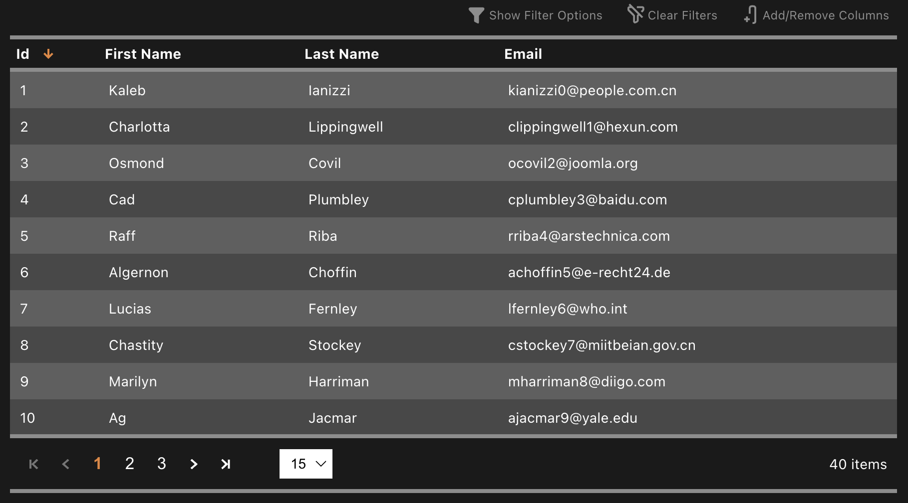

  

<h1 align="center">Data Grid Vue</h1>

  

 

#include "./vuepress/shared/summary.md"

  
  
  
  

  :point_right: <a href="https://datagridvue.com/guide" target="_blank">Quick Start</a> :point_left:

 

  

 

#include "./vuepress/shared/simple-example-codeblock.md"

#include "./vuepress/shared/features.md"

  :heart: <a href="https://github.com/sponsors/nruffing" target="_blank">Sponsor</a> :heart:
  |
  :point_right: <a href="https://datagridvue.com/guide" target="_blank">Quick Start</a> :point_left:
    
  :beetle: <a href="https://github.com/nruffing/data-grid-vue/issues/new?assignees=nruffing&labels=bug&projects=&template=bug_report.md&title=%5Bbug%5D">Report Bug</a>
  |
  :sparkle: <a href="https://github.com/nruffing/data-grid-vue/issues/new?assignees=nruffing&labels=enhancement&projects=&template=feature_request.md&title=%5Bfeature%5D">Feature Request</a>
  |
  :books: <a href="https://datagridvue.com" target="_blank">Documentation</a>
  |
  :question: <a href="https://github.com/nruffing/data-grid-vue/issues/new?assignees=nruffing&labels=support&projects=&template=support-request.md&title=%5Bsupport%5D">Questions</a>
  |
  :scroll: <a href="https://datagridvue.com/changelog" target="_blank">Changelog</a>
    
  :package: <a href="https://www.npmjs.com/package/data-grid-vue" target="_blank">NPM</a>
  |
  :package: <a href="https://yarnpkg.com/package?name=data-grid-vue" target="_blank">Yarn</a>

#include "./vuepress/shared/changelog.md"

## Contributing

For more information, read the [contribution guide](https://github.com/nruffing/data-grid-vue/blob/main/CONTRIBUTING.md).

## Code of Conduct

For more information, read the community [code of conduct](https://github.com/nruffing/data-grid-vue/blob/main/CODE_OF_CONDUCT.md).